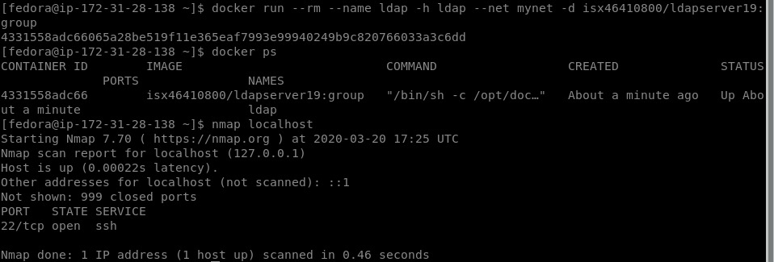
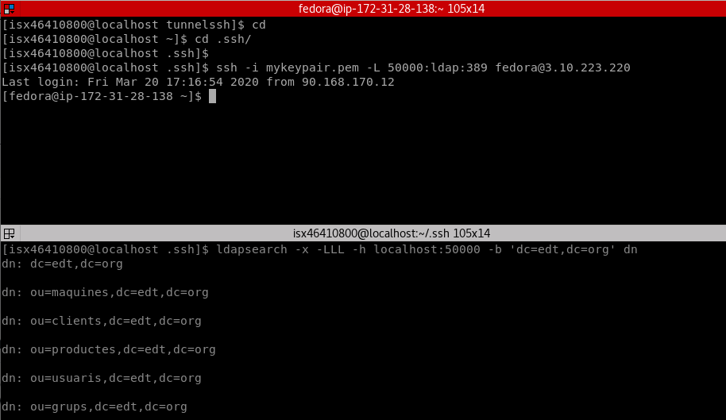
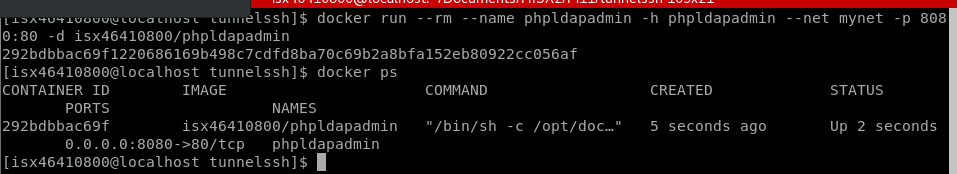
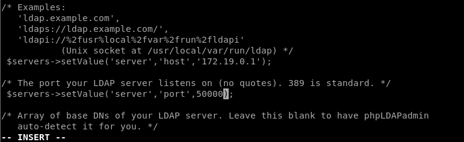
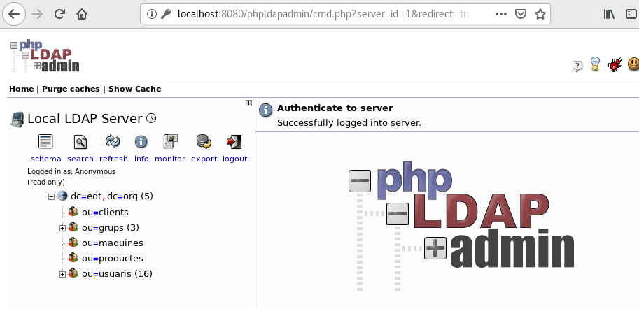
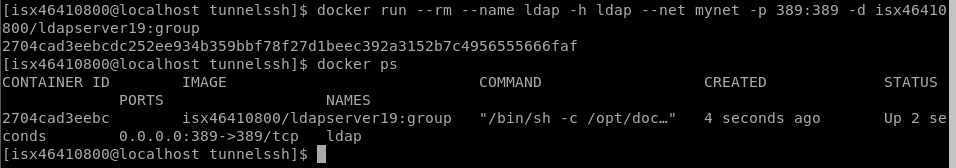
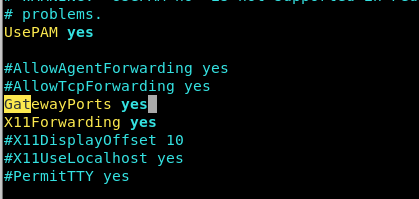
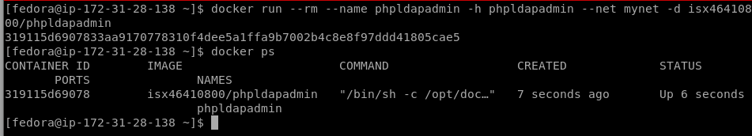
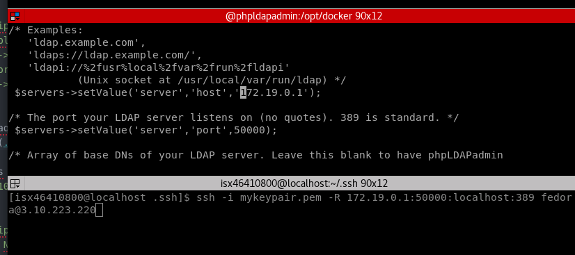
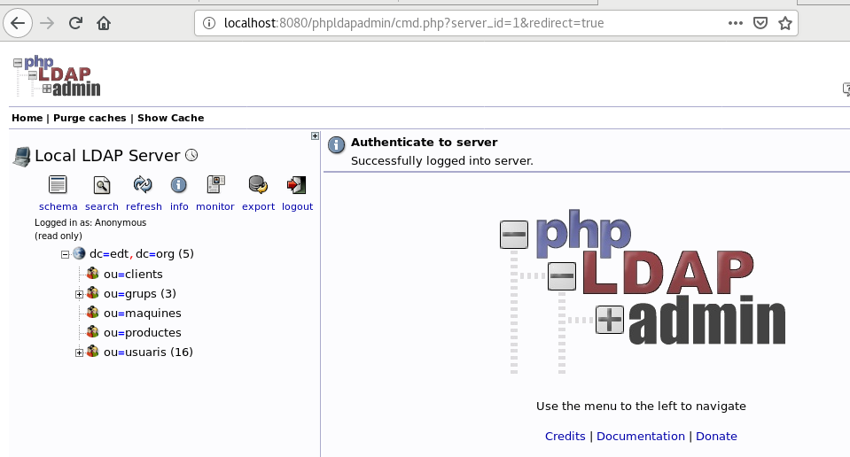

# README

## <u>Exemple-15 Ldap-remot i phpldapadmin-local</u>
+ **Explicació:**
+ Desplegem dins d’un container Docker (host-remot) en una AMI (host-destí) el servei ldap amb el firewall de la AMI només obrint el port 22. Localment al host de
l’aula (host-local) desplegem un container amb phpldapadmin. Aquest container ha de poder accedir a les dades ldap. des del host de l’aula volem poder visualitzar el
phpldapadmin.

### Desplegar el servei ldap
+ En el host-remot AMI AWS EC2 engegar un container ldap sense fer map dels ports.
+ En la ami cal obrir únicament el port 22
+ També cal configurar el /etc/hosts de la AMI per poder accedir al container ldap per nom de host (preferentment).
+ verificar que des del host de l’aula (host-local) podem fer consultes ldap.

### Desplegar el servei phpldapadmin
+ Engegar en el host de l’aula (host-local) un container docker amb el servei phpldapadmin fent map del seu port 8080 al host-local (o no).
+ Crear el túnel directe ssh des del host de l’aula (host-local) al servei ldap (host-remot) connectant via SSH al host AMI (host-destí).
+ Configurar el phpldapadmin per que trobi la base de dades ldap accedint al host de l’aula al port acabat de crear amb el túnel directe ssh.
+ Ara ja podem visualitzar des del host de l’aula el servei phpldapadmin, accedint al port 8080 del container phpldapadmin o al port que hem fet map del host de l’aula (si és que ho hem fet).

## <u>Exemple-16. Ldap-local i phpldapadmin-remot</u>
+ **Explicació:**
+ Obrir localment un ldap al host. Engegar al AWS un container phpldapadmin que usa el ldap del host d el’aula. Visualitzar localment al host de l’aula el phpldapadmin del container de AWS EC2. Ahí ez nà.

### Engegar ldap i phpldapadmin i que tinguin connectivitat:
+ Engegar localment el servei ldap al host-local de l’aula.
+ Obrir un túnel invers SSH en la AMI de AWS EC2 (host-destí) lligat al servei ldap del host-local de l’aula.
+ Engegar el servei phpldapadmin en un container Docker dins de la màquina AMI. cal confiurar-lo perquè connecti al servidor ldap indicant-li la ip de la AMI i el port obert per el túnel SSH.
+ *nota* atenció al binding que fa ssh dels ports dels túnels SSH (per defecte són només al localhost).

### Ara cal accedir des del host de l’aula al port 8080 del phpldapadmin per visualitzar-lo. Per fer-ho cal:
+ En la AMI configutat el /etc/hosts per poder accedir per nom de host (per exemple php) al port apropiat del servei phpldapadmin.
+ Establir un túnel directe del host de l’aula (host-local) al host-remot phpldapadmin passant pel host-destí (la AMI).
+ Ara amb un navegador ja podem visualitzar localment des del host de l’aula el phpldapadmin connectant al pot directe acabat de crear.
+ *nota* atenció al binding que fa ssh dels ports dels túnels SSH (per defecte són només al localhost).

## Exemple-15 Ldap-remot i phpldapadmin-local

### Desplegar el servei ldap

+ Conecto vía ssh a la AMI AWS:  
`[isx46410800@localhost .ssh]$ ssh -i mykeypair.pem fedora@3.10.223.220`

+ Enciendo el container ldap sin mapear puertos:  
`[fedora@ip-172-31-28-138 ~]$ docker run --rm --name ldap -h ldap --net mynet -d isx46410800/ldapserver19:group`

+ Compruebo que está funcionando:  
`[fedora@ip-172-31-28-138 ~]$ docker ps`

+ Compruebo que solo está abierto el puerto 22:  
`[fedora@ip-172-31-28-138 ~]$ nmap localhost`

+ Aquí vemos una captura:  


+ Vemos que IP tiene nuestro container y lo agregamos al /etc/hosts para más comodidad y utilizar el nombre en vez de la IP:  
`[fedora@ip-172-31-28-138 ~]$ docker network inspect mynet`
```
"Name": "ldap",
                "EndpointID": "0802c642b5a1a26501200dc060edbfefc67b205399dec8c621318c7a110762b3",
                "MacAddress": "02:42:ac:12:00:02",
                "IPv4Address": "172.18.0.2/16",
                "IPv6Address": ""
```
`[fedora@ip-172-31-28-138 ~]$ sudo vim /etc/hosts`

  ```
  127.0.0.1   localhost localhost.localdomain localhost4 localhost4.localdomain4
  ::1         localhost localhost.localdomain localhost6 localhost6.localdomain6
  172.18.0.2 ldap
  ```
+ Verificamos que desde el host de casa(host-local) podemos acceder al ldap del container de la AMI AWS haciendo un tunel ssh directo desde un puerto dinámico de mi host(50000) hacia al host destino(AMI) que redirige al puerto ldap 389 del host remoto:  
```
[isx46410800@localhost .ssh]$ ssh -i mykeypair.pem -L 50000:ldap:389 fedora@3.10.223.220
Last login: Fri Mar 20 17:16:54 2020 from 90.168.170.12
```
```
[isx46410800@localhost .ssh]$ ldapsearch -x -LLL -h localhost:50000 -b 'dc=edt,dc=org' dn
dn: dc=edt,dc=org
dn: ou=maquines,dc=edt,dc=org
dn: ou=clients,dc=edt,dc=org
dn: ou=productes,dc=edt,dc=org
dn: ou=usuaris,dc=edt,dc=org
dn: ou=grups,dc=edt,dc=org
dn: cn=1asix,ou=grups,dc=edt,dc=org
...
```
+ Aquí lo vemos con una captura:  


#### Desplegar el servei phpldapadmin

+ Encendemos en el host local de casa un phpldapadmin:  
`[isx46410800@localhost tunnelssh]$ docker run --rm --name phpldapadmin -h phpldapadmin --net mynet -p 8080:8080 -d isx46410800/phpldapadmin`

+ Configuramos el phpldapadmin entrando en interactivo para cambiar los valores para encontrar al ldap:    
`[isx46410800@localhost tunnelssh]$ docker exec -it phpldapadmin /bin/bash`

+ Vemos aquí con una captura:  


+ Cambiamos los valores del fichero de configuración del phpldapadmin:  
`[root@phpldapadmin docker]# vi /etc/phpldapadmin/config.php`

+ Como la interfície que tenemos que dirigir es la creada en mynet de nuestro host local, en nuestro caso(172.19.0.1) y puerto 50000, lo indicamos en el fichero de configuración:  
```
$servers->setValue('server','host','172.19.0.1');
/* The port your LDAP server listens on (no quotes). 389 is standard. */
$servers->setValue('server','port',50000);
```

+ Vemos aquí con una captura:  


+ Encendemos de nuevos los servicios del container phpldapadmin:  
```
/sbin/php-fpm
/sbin/httpd
```

+ Creamos el tunel ssh directo desde el host local hasta la AMI y este redirija a ldap 389:  
`[isx46410800@localhost .ssh]$ ssh -i mykeypair.pem -L 172.19.0.1:50000:ldap:389 fedora@3.10.223.220`

+ Comprobamos entrando en el navegador:  

  ```
  http://localhost:8080/phpldapadmin
  **Podemos entrar como anonymous
  ```

+ Vemos aquí con una captura:  


## Exemple-16. Ldap-local i phpldapadmin-remot

### Engegar ldap i phpldapadmin i que tinguin connectivitat:

+ Encendemos en nuestro host de casa un container ldap:  
`[isx46410800@localhost tunnelssh]$ docker run --rm --name ldap -h ldap --net mynet -p 389:389 -d isx46410800/ldapserver19:group`

+ Vemos aquí con una captura:  


+ Como indica en la teoría, por defecto se hace BIND en localhost, para que haga en otras interfícies hay que modificar el fichero de /etc/ssh/sshd_config. En este caso lo haremos en la AMI para que permita los túneles inversos:  
`[fedora@ip-172-31-28-138 ~]$ sudo vim /etc/ssh/sshd_config`
> modificamos en _GatewaysPorts yes_

+ Vemos aquí con una captura:  


+ Encendemos container phpldapadmin en la AMI:  
`[fedora@ip-172-31-28-138 ~]$ docker run --rm --name phpldapadmin -h phpldapadmin --net mynet -d isx46410800/phpldapadmin`

+ Vemos aquí con una captura:  


+ Cambiamos el fichero de configuración del phpldapadmin para que puedan hacer bind con la red de mi ldap en host local de casa:  
```
[isx46410800@localhost .ssh]$ docker inspect ldap
"Gateway": "172.19.0.1",
"IPAddress": "172.19.0.2",
```
```
[fedora@ip-172-31-28-138 ~]$ docker exec -it phpldapadmin /bin/bash
[root@phpldapadmin docker]# vi /etc/phpldapadmin/config.php
$servers->setValue('server','host','172.19.0.1');
/* The port your LDAP server listens on (no quotes). 389 is standard.
$servers->setValue('server','port',50000);
```

+ Vemos aquí con una captura:  


+ Creamos tunel inverso desde host local con el container ldap encendido con la interficie gateway del container phpldapadmin de la AMI y el puerto 50000 para que se pueda hacer bind:  
`[isx46410800@localhost .ssh]$ ssh -i mykeypair.pem -R 172.19.0.1:50000:localhost:389 fedora@3.10.223.220`
```
[fedora@ip-172-31-28-138 ~]$ nmap localhost
Starting Nmap 7.70 ( https://nmap.org ) at 2020-03-20 19:26 UTC
Nmap scan report for localhost (127.0.0.1)
Host is up (0.00020s latency).
Other addresses for localhost (not scanned): ::1
Not shown: 998 closed ports
PORT      STATE SERVICE
22/tcp    open  ssh
50000/tcp open  ibm-db2
Nmap done: 1 IP address (1 host up) scanned in 0.08 seconds
[fedora@ip-172-31-28-138 ~]$ netstat -tan4
Active Internet connections (servers and established)
Proto Recv-Q Send-Q Local Address           Foreign Address         State      
tcp        0      0 0.0.0.0:50000           0.0.0.0:*               LISTEN     
tcp        0      0 0.0.0.0:22              0.0.0.0:*               LISTEN
```

### Ara cal accedir des del host de l’aula al port 8080 del phpldapadmin per visualitzar-lo. Per fer-ho cal:

+ Añadimos la resolución al /etc/hosts:  
`172.18.0.2 phpldapadmin`

+ Creamos tunel directo en host local que abra nuestro puerto 8080 y lo redirija a la AMI AWS:  
`[isx46410800@localhost .ssh]$ ssh -i mykeypair.pem -L 8080:phpldapadmin:80 fedora@3.10.223.220`

+ Vemos los puertos que tenemos abiertos en la AMI:  
```
[fedora@ip-172-31-28-138 ~]$ nmap localhost
Starting Nmap 7.70 ( https://nmap.org ) at 2020-03-20 19:33 UTC
Nmap scan report for localhost (127.0.0.1)
Host is up (0.00048s latency).
Other addresses for localhost (not scanned): ::1
Not shown: 997 closed ports
PORT      STATE SERVICE
22/tcp    open  ssh
8080/tcp  open  http-proxy
50000/tcp open  ibm-db2
```

+ Vemos los binds:  
```
[fedora@ip-172-31-28-138 ~]$ netstat -tan4
Active Internet connections (servers and established)
Proto Recv-Q Send-Q Local Address           Foreign Address         State      
tcp        0      0 0.0.0.0:8080            0.0.0.0:*               LISTEN     
tcp        0      0 0.0.0.0:50000           0.0.0.0:*               LISTEN     
tcp        0      0 0.0.0.0:22              0.0.0.0:*               LISTEN     
tcp        0      0 172.31.28.138:22        90.168.170.12:60876     ESTABLISHED
tcp        0      0 172.31.28.138:22        90.168.170.12:58062     ESTABLISHED
tcp        0    324 172.31.28.138:22        90.168.170.12:60858     ESTABLISHED
```

+ Comprobamos entrando en el navegador:  

  ```
  http://localhost:8080/phpldapadmin
  **Podemos entrar como anonymous
  ```

+ Vemos aquí con una captura:

